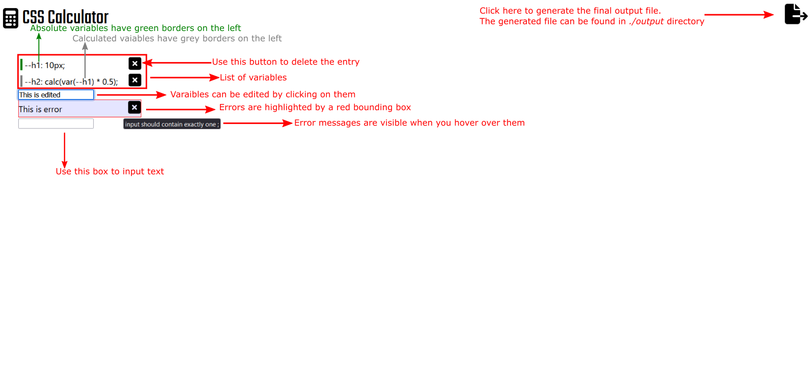

# CSS CALCULATOR

**CSS-Calculator is not a calculutaor build with css.**

CSS Calculator is a modern web app built to help frontend develoeprs to write better CSS. CSS-Calculator replaces variables with calculated values with computed values.

It converts code blocks written like this

```css
--h1: 20vh;
--h2: calc(var(--h1) * 0.5);
--h3: calc(var(--h2) * 0.435); //=> might not always works
```

Into code blocks written like this

```css
--h1: 20vw;
--h2: 10vh;
--h3: 4.35vh; // => will work
```

# Features

- Variable classification
- Automatic calculation resolution
- Error detection and automatic error mesage generation
- Changes automatically saved in local storage

# 📸 Screenshot


# How to



> The resultant file is stored in `./output` directory

# Built With ⚒️

- [Node.js](https://nodejs.org/en/) : Node.js® is an open-source, cross-platform JavaScript runtime environment.

- [Yarn](https://yarnpkg.com) : Yarn is a package manager that doubles down as project manager. Whether you work on one-shot projects or large monorepos, as a hobbyist or an enterprise user, we've got you covered

- [React](https://reactjs.org/) : A JavaScript library for building user interfaces

- [Express](https://expressjs.com/) : Fast, unopinionated, minimalist web framework for Node.js

# Prerequisite

- [Node.js](https://nodejs.org/en/)
- [Yarn](https://yarnpkg.com)
- [React](https://reactjs.org/)

# Getting Started

> CSS-Calculator is monorepo built with yarn worksapces

## 1. Installing the app

```
yarn install
```

## 2. Runnig the app

```
yarn start
```

> Two ports are used when the app is run locally. The frontend runs on port **3000** and the backend runs on port **3200**.
>
> When the above script is run it will automatically launch a browser instance with the front end running, in case if this fails to happen please navigate to http://localhost:3000/

## 3. Testing the app

```
yarn test
```
